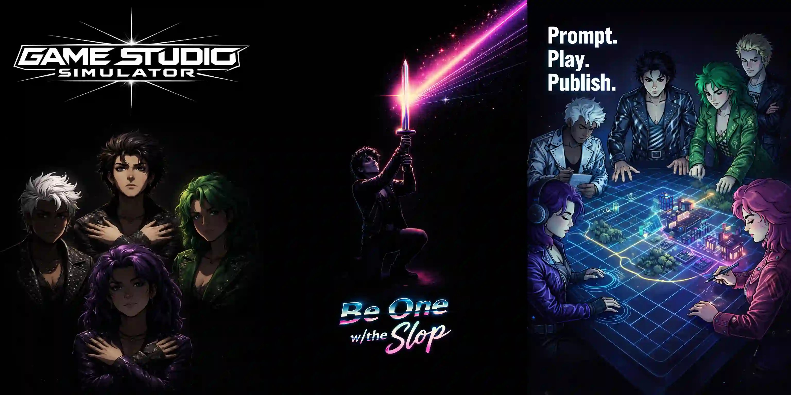

> You have a game idea.
>
> We have the agents.
>
> Prompt it, watch it come to life, iterate like crazy, and actually\
> finish something for once in your pathetic, *human* life.

# Prompt. Play. Publish.

Game Studio Simulator (GSS) is an AI-powered game development studio in a
single app. You direct; specialized agents execute, and you play the result in
a live, playable canvas. The editor is the game.

https://gamestudiosimulator.com

## Project Status

Pre-release.

## Game Studio Simulator (GSS)

Game Studio Simulator is an AI-directed system for constructing games through
modular agents. A **Director Claw** coordinates specialized skills that
generate well-defined modules which can be composed into a working game.

The initial target is **2D platformers**, but the architecture is designed to
expand to other genres.

The system emphasizes:

* strict module boundaries
* explicit APIs between components
* event-driven composition
* agent-generated artifacts that remain understandable and testable

---

# Architecture Overview

## Core Concept

GSS operates through a **Director model**.

A single orchestrating agent, the **Claw**, plans the structure of the game and invokes specialized skills to generate the components required to build it.

The Director never writes code directly.
Instead it assembles independently generated modules.

```
User Prompt
     ↓
Director Claw
     ↓
Skill Invocation
     ↓
Module Generation
     ↓
Dependency Resolution
     ↓
Game Assembly
```

---

# Module System

Every artifact produced by the system is packaged as a **Module**.

Modules are self-contained units that expose a strict API and declare their dependencies.

```
module/
  module.json
  code/
  assets/
  tests/
  readme.md
```

The `module.json` file defines the contract the Director uses to compose systems.

Example:

```json
{
  "name": "double_jump",
  "type": "mechanic",
  "version": "1.0",
  "api": {
    "events_in": ["player_jump"],
    "events_out": ["double_jump_triggered"],
    "state": ["remaining_jumps"]
  },
  "dependencies": ["player_controller"]
}
```

Modules are designed to be:

* composable
* inspectable
* replaceable
* testable

---

# Event System

All modules communicate through **events**.

Modules do not call each other directly.
Instead they emit and subscribe to events in the game runtime.

```
Input → Entity → Mechanic → Physics → Render
```

Example:

```
input_jump
   ↓
player_controller
   ↓
player_jump
   ↓
wall_jump_module
   ↓
velocity_change
   ↓
physics_system
```

This architecture allows the Director to rearrange systems without rewriting code.

---

# Skill System

Skills are specialized generators responsible for producing modules.

Each skill focuses on a narrow domain.

Typical skills include:

### Mechanic Designer

Creates gameplay mechanics such as abilities, enemy behaviors, and interactive objects.

### Entity Architect

Defines game entities such as players, enemies, collectibles, and world objects.

### Physics Generator

Produces motion and collision systems appropriate for the platformer environment.

### Level Generator

Constructs level layouts, spawn points, triggers, and progression structures.

### Asset Generator

Creates sprites, animation sheets, tilesets, and UI elements.

### QA Simulation

Runs automated simulations to validate mechanics, difficulty, and playability.

---

# Director Claw

The **Director Claw** is responsible for orchestrating the system.

Responsibilities include:

* interpreting the user prompt
* planning the module graph
* invoking skills
* validating module APIs
* resolving dependencies
* assembling the runtime configuration

The Director operates on a **game plan graph** rather than raw code.

```
GamePlan
 ├─ Modules
 ├─ Event Graph
 ├─ Asset Registry
 └─ Level Layout
```

---

# Validation

Before modules are accepted into the game plan they are validated.

Validation checks include:

* API compatibility
* dependency resolution
* event schema correctness
* test presence
* runtime integration safety

This allows the Director to reason about modules without needing to interpret the code itself.

---

# Design Goals

GSS is designed to enable:

* agent-driven game construction
* composable gameplay systems
* transparent architecture
* iterative AI collaboration
* extensible genre support

The system favors **many small modules over large monolithic codebases**, making it suitable for automated generation and modification.
